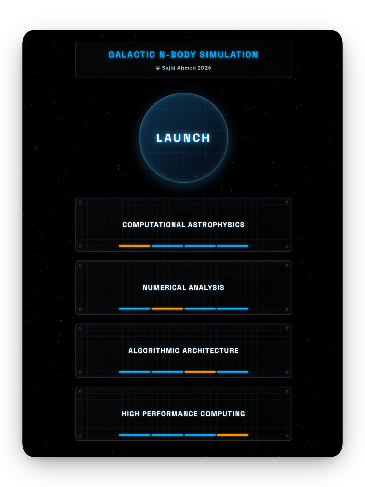
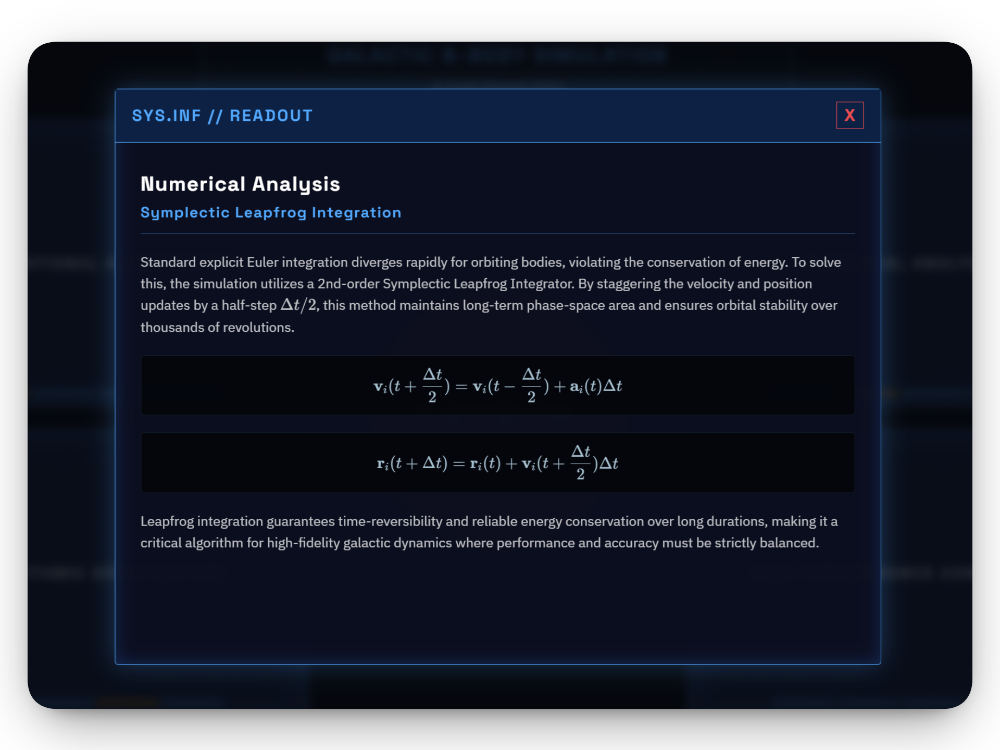
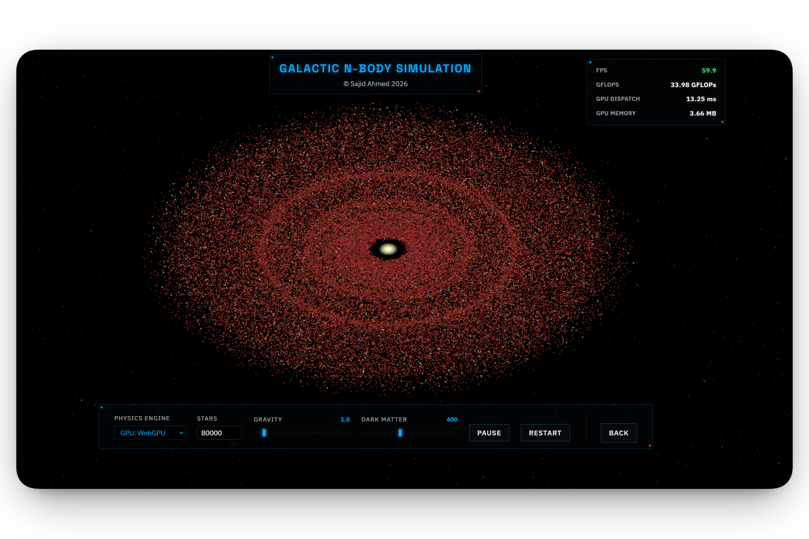
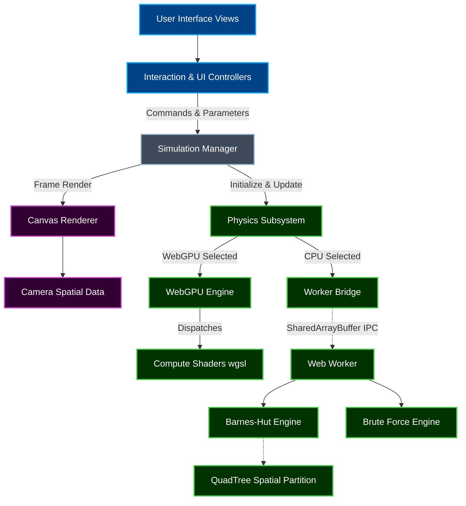

# Galactic N-Body Simulation


**[Live Demo](https://galaxy.sajidahmed.co.uk/) • [Documentation](https://github.com/sahmed0/galaxy-n-body-simulation.git)**

A high-performance, real-time galactic N-body simulation leveraging TypeScript, Vite, and WebGPU to model stellar dynamics with computational astrophysics methodologies.

## Table of Contents

- [Features](#features)
- [Tech Stack](#tech-stack)
- [Key Decisions](#key-decisions)
- [Challenges & Lessons](#challenges--lessons)
- [Architecture](#architecture)
- [Getting Started](#getting-started)
- [Usage](#usage)
- [Contributing](#contributing)
- [License](#license)

## Features

- **Multiple Physics Engines**: Choose between an $O(N^2)$ direct-sum CPU Brute Force engine, an $O(N \log N)$ CPU Barnes-Hut quadtree engine, and a highly parallelised GPU WebGPU Compute Shader engine.

<p align="center">
  
</p>

- **Active/Passive Computational Subsetting**: Simulates realistic mass distribution without quadratic overhead by simulating heavy, gravity-exerting "active" stars and lightweight "passive" stars.

- **Symplectic Leapfrog Integration**: Ensures long-term orbital stability and energy conservation, vital for galactic dynamics.

<p align="center">
  
</p>

- **Isothermal Dark Matter Halo**: Implicitly integrates a dark matter potential to model the flat rotation curves of galaxies without the computational cost of simulating dark matter particles.

- **Salpeter Initial Mass Function & H-R Colours**: Assigns stellar mass accurately according to the Salpeter IMF and correlates star colours roughly with the main sequence of the Hertzsprung-Russell diagram.

- **High-Performance Web Worker Architecture**: Offloads CPU-bound physics to dedicated web workers using zero-copy `SharedArrayBuffer` memory allocations, preventing main-thread blocking.

- **Retro-Futuristic Tactical Glass UI**: A visually stunning interface combining deep space aesthetics with functional and responsive controls.

<p align="center">
  
</p>

## Tech Stack

- **Primary Language**: [TypeScript](https://www.typescriptlang.org/)
- **Build Tool / Framework**: [Vite](https://vitejs.dev/)
- **Graphics & Computation**: [WebGPU API](https://www.w3.org/TR/webgpu/)
- **Mathematical Rendering**: [KaTeX](https://katex.org/)

## Key Decisions

| Technology / Pattern          | Decision Rationale                                                                                                                                                      |
| :---------------------------- | :---------------------------------------------------------------------------------------------------------------------------------------------------------------------- |
| **WebGPU Compute Shaders**    | Selected over WebGL for compute tasks due to its native support for storage buffers and compute pipelines, enabling heavily parallelised $O(N^2)$ gravity kernels.      |
| **SharedArrayBuffer IPC**     | Used for CPU workers (Barnes-Hut, Brute Force) to bypass expensive memory-copy overheads when sending millions of coordinates between threads.                          |
| **Ping-Pong Buffering (GPU)** | Ensures race-condition-free reads/writes inside the shader. The vertex shader natively parses the output buffer directly, avoiding PCI-e bus transfers back to CPU RAM. |
| **Leapfrog Integrator**       | Chosen over Euler and Runge-Kutta. Crucial for long-term symplectic energy conservation across thousands of orbital periods.                                            |

## Challenges & Lessons

- **Parallel Computing Synchronisation**: Balancing atomic locks across web-workers using JavaScript `Atomics.wait` to ensure the main UI thread never evaluates a half-drawn coordinate map taught me the deep intricacies of lock-free memory safety.
- **Algorithmic Optimisation**: Building a QuadTree for the Barnes-Hut algorithm that rebuilds itself every $16$ milliseconds exposed massive Garbage Collection bottlenecks. I solved this by implementing an independent Object Pool within the QuadTree structure to perfectly recycle object memory layout without GC spikes.
- **Modern Hardware Graphics APIs**: Converting standard math loops into zero-branching WGSL array transformations demonstrated the massive mathematical capability of WebGPU arrays when bypassing typical CPU branch-prediction limitations.

## Architecture

```text
~/n-body/
├── package.json
├── vite.config.ts
├── index.html          # Application landing page
├── sim.html            # Main simulation view
└── src/
    ├── landing.ts      # Logic for the landing page readouts
    ├── simulation.ts   # Core bootstrapper and render loop for the simulation
    ├── physics/        # Real-time simulation engines and collision structures
    │   ├── BruteForceEngine.ts
    │   ├── BarnesHutEngine.ts
    │   ├── QuadTree.ts
    │   ├── WebGPUEngine.ts
    │   ├── WorkerBridge.ts
    │   ├── physics.worker.ts
    │   └── shaders.wgsl
    ├── rendering/      # Graphical drawing and camera logic
    │   ├── Camera.ts
    │   └── CanvasRenderer.ts
    ├── state/          # Simulation state management
    │   └── SimulationManager.ts
    ├── ui/             # View layer and interaction controllers
    │   ├── UIController.ts
    │   ├── InteractionController.ts
    │   └── ui.css
    └── utils/          # Generic helper functions
```

### High-Level Subsystem Flow



## Getting Started

- If you wish to install and use this repository locally, follow the instructions below:
- **NOTE**: As per the Licence, you may only fork/clone this repository for personal usage and review purposes only, all commercial usage and unauthorised distribution is strictly prohibited.

### Prerequisites

- [Node.js](https://nodejs.org/) (Version 18 or higher recommended)
- A WebGPU-capable browser (e.g., Google Chrome 113+, Microsoft Edge 113+).
- The development server MUST enforce [Cross-Origin Isolation](https://web.dev/coop-coep/) to permit the use of `SharedArrayBuffer`.

### Installation

1. Clone the repository and navigate to the project directory:

   ```bash
   git clone https://github.com/sahmed0/galaxy-n-body-simulation.git
   cd galaxy-n-body-simulation
   ```

2. Install dependencies:

   ```bash
   npm install
   ```

3. Start the local development server:

   ```bash
   npm run dev
   ```

   The server will launch with `Cross-Origin-Opener-Policy` and `Cross-Origin-Embedder-Policy` headers configured properly by Vite plugins.

## Usage

Navigate to the local development server URL (usually `http://localhost:5173`). Have a look at the introductory learning resources on the landing page, and then click **LAUNCH** to open the simulation.

### CLI Commands

- `npm run dev` - Starts the Vite development server.
- `npm run build` - Compiles TypeScript and creates a production build.
- `npm run preview` - Previews the production build locally.

---

## License


Copyright (c) 2026 Sajid Ahmed. **All Rights Reserved.**

This repository is a **Proprietary Project**.

While I am a strong supporter of Open Source Software, this specific codebase represents a significant personal investment of time and effort and is therefore provided with the following restrictions:

- **Permitted:** Viewing, forking (within GitHub only), and local execution for evaluation and personal, non-commercial usage only.
- **Prohibited:** Modification, redistribution, commercial use, and AI/LLM training.

For the full legal terms, please see the [LICENSE](./LICENSE) file.
