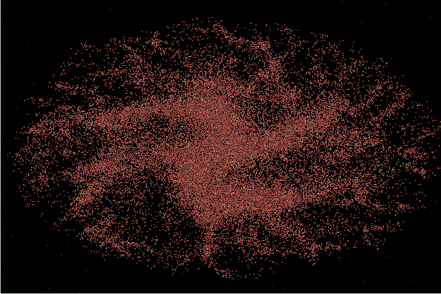
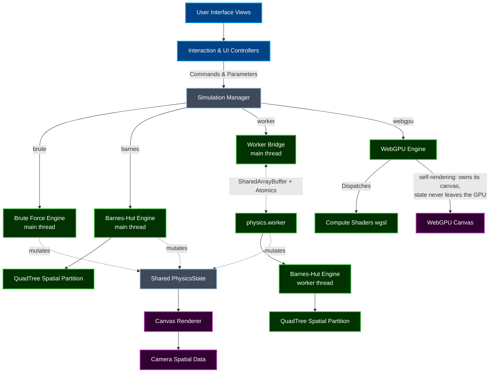

# Galaxy N-Body Simulation

**A real-time TypeScript N-body simulation with four interchangeable physics engines - direct-sum, Barnes-Hut, an off-thread `SharedArrayBuffer` worker, and a WebGPU compute pipeline - built on an analytically verified physics core.**


<p align="center">
  
</p>

[](https://github.com/sahmed0/galaxy-n-body-simulation/actions/workflows/test.yml)


**[Live Demo](https://galaxy.sajidahmed.co.uk/)** • **[Seeded permalink example](https://galaxy.sajidahmed.co.uk/sim.html#s=12345&n=10000&e=webgpu&p=galaxy&g=1&dm=250)** - that link reproduces the same galaxy on every load.

## Table of Contents

- [Simulation Presets](#simulation-presets)
- [Features](#features)
- [Verification & Testing](#verification--testing)
- [Benchmarks](#benchmarks)
- [Architecture](#architecture)
- [Key Decisions](#key-decisions)
- [Challenges & Lessons](#challenges--lessons)
- [Reproducibility](#reproducibility)
- [Getting Started](#getting-started)
- [Usage](#usage)
- [License](#license)

## Simulation Presets

- **Galaxy (spiral)** - a massive, self-gravitating exponential disk tuned to the Toomre _Q_ stability criterion, embedded in a dark-matter halo, that develops transient spiral arms.
- **Accretion Disk (SMBH)** - a dominant central black hole surrounded by a collisionless Keplerian test-particle disk (the ballistic limit; no viscous inspiral), with an adaptive timestep to resolve the deep central well and dark matter off by default.

## Features

### Four physics engines

Selectable at runtime. Each has a body-count ceiling set by what it can actually sustain; the UI clamps to it and tells you why.

| Engine | Algorithm | Where it runs | Max N |
| :--- | :--- | :--- | ---: |
| **Brute Force** | $O(N^2)$ direct sum | Main thread | 20 000 |
| **Barnes-Hut** | $O(N \log N)$ quadtree | Main thread | 50 000 |
| **Worker** | $O(N \log N)$ quadtree | Dedicated Web Worker, over a `SharedArrayBuffer` | 50 000 |
| **WebGPU** | $O(N^2)$, workgroup-tiled | GPU compute shader | 200 000 |

WebGPU is the default and falls back to Barnes-Hut - with a banner, not a crash - when no device is available or the device is lost. The Worker engine requires cross-origin isolation and falls back the same way without it.

### Physics

- **Symplectic leapfrog integration** - kick-drift, with velocities staggered half a step ahead of positions. Any runtime change to `dt` or `G` re-establishes the stagger rather than silently corrupting it.
- **Self-gravitating galaxy initial conditions** - the disk's rotation curve is *measured* from the realized particle field rather than assumed, then given Toomre-_Q_ velocity warming (with a Plummer-softening Hankel correction) and the resulting asymmetric drift.
- **Adaptive timestep** - the minimum of the preset `dt`, an orbital-resolution limit, and a close-encounter limit, floored so it can never stall.
- **Isothermal dark matter halo** - an analytic potential reproducing flat rotation curves without simulating halo particles.
- **Salpeter IMF & H-R colours** - stellar masses drawn from the Salpeter initial mass function; colours track the main sequence of the Hertzsprung-Russell diagram.
- **Active/Passive subsetting** - heavy stars exert gravity; the lightweight majority receive it without contributing, buying visual density without quadratic cost.

### Diagnostics & reproducibility

- **Live energy-conservation panel** - plots $\Delta E/E_0$ for the active subsystem, computed exactly (full KE + pairwise PE + analytic external potentials) in float64, chunked across frames from a snapshot so no frame pays for the whole $O(N^2)$ sum. Hidden on the GPU engine, where particle state never leaves the device.
- **Seeded permalinks** - the Share button copies a URL encoding the seed and parameters; opening it reproduces the same initial conditions.
- **In-app benchmark harness** - `sim.html?bench=1` sweeps every engine and count and emits a copyable markdown table.
- **Honest telemetry** - pair-interactions/second from exact per-engine counts, with GPU pass time from `timestamp-query` where the hardware supports it.

## Verification & Testing

The physics core is checked against closed-form solutions and conservation laws, not eyeballed. **20 test files - 19 [Vitest](https://vitest.dev/) suites and one [Playwright](https://playwright.dev/) browser suite** - both run in CI on every push, and the deploy is gated on them passing.

```bash
pnpm test      # unit + analytic suites (vitest)
pnpm e2e       # real-browser smoke suite (playwright, chromium)
```

### What each suite proves

| Suite | What it proves |
| :--- | :--- |
| `tests/physics/integrator.test.ts` | A two-body orbit closes on itself after one period; leapfrog holds a **bounded** energy band where forward Euler drifts secularly - on the *identical* force law, isolating the integrator as the variable. |
| `tests/physics/conservation.test.ts` | Total linear momentum is conserved and the centre of mass tracks $x(0) + (P/M)t$ to float64 roundoff over 4 000 steps - catching any self-acceleration or asymmetric kick. |
| `tests/physics/field-terms.test.ts` | All three force kernels match their closed forms: softened point mass, isothermal halo (including flat-rotation-curve asymptotics), and Plummer-softened pairwise gravity reducing to Newton for $r \gg \varepsilon$ while staying finite at coincidence. |
| `tests/physics/barnes-hut.test.ts` | The tree's *only* deviation from the exact sum is the $\theta$ multipole approximation: it degenerates to brute force at $\theta = 0$, and RMS force error shrinks monotonically as $\theta$ does. |
| `tests/physics/quadtree.test.ts` | Mass is conserved under tree aggregation and every node carries the exact mass-weighted centre-of-mass recurrence, including the coincident-particle cutoff. |
| `tests/physics/engine-energy.test.ts` | Whole production engines, stepping a real float32 state for 5 000 steps, keep total energy in a bounded band rather than drifting - symplecticity at the engine level, not just the kernel. The pinned black hole never moves. |
| `tests/physics/energy-monitor.test.ts` | The live $\Delta E/E_0$ readout is exact: its resumable chunked sum equals a direct double loop at *any* chunk budget, and its baseline lifecycle never publishes a stale sample. |
| `tests/physics/worker-protocol.test.ts` | The `SharedArrayBuffer` handshake never double-counts a step, and simulated time advances only by steps the worker actually completed. |
| `tests/state/salpeter.test.ts` | The mass sampler genuinely draws from the Salpeter IMF - a Kolmogorov-Smirnov test against the analytic CDF, made non-flaky by a seeded generator. |
| `tests/state/determinism.test.ts` | One seed yields exactly one realization, byte-for-byte, across managers and both presets - the guarantee a shared permalink rests on. |
| `tests/state/adaptive-timestep.test.ts` | `dt` always resolves the fastest orbit in the system and can never collapse below its floor. |
| `tests/gpu/uniform-layout.test.ts` | Parses `shaders.wgsl` statically and proves the TypeScript uniform write order is byte-identical to the WGSL struct - the failure mode that otherwise corrupts GPU state silently. |
| `src/state/SimulationManager.*.test.ts` | The galaxy IC is in genuine centrifugal balance with the engine's real forces (it stays bound under both CPU engines); the accretion disk is a true Keplerian field; the WebGPU fallback and device-loss recovery state machine behaves. |
| `e2e/smoke.spec.ts` | The seams no unit test reaches: every CPU engine - including the worker - actually **paints** in a real browser, the energy readout goes live, WebGPU falls back gracefully, and a permalink reproduces identical initial conditions across two separate page loads. |

Numeric tolerances are measured first and then frozen with margin, with the measured value recorded in a comment beside each. They are deliberately not tight bounds: the point is to catch a regression of physical significance, not to fail on the last bit.

## Benchmarks

Performance numbers are measured, not estimated. The app ships its own harness: open **`sim.html?bench=1`**, click *Run benchmark*, and it sweeps every engine and body count, then emits a copyable markdown table.

**Methodology.** Galaxy preset, one fixed seed across all configurations (so engines at the same N face identical initial conditions), 2 s warm-up discarded, then a 5 s measurement window. GPU pass time comes from WebGPU `timestamp-query` where the adapter supports it, falling back to an `onSubmittedWorkDone` wall-clock reading marked `(approx)`. The same overlay runs a naive-vs-tiled kernel parity check to confirm the two GPU kernels agree numerically.

**Hardware:** Intel Core i5 12500H / Intel Iris Xe / Chrome 150 / Windows 11

| engine | kernel | N | steps/s | frame ms | GPU pass ms |
|---|---|---|---|---|---|
| brute | - | 5000 | 16.3 | 306.68 | - |
| brute | - | 10000 | 9.4 | 532.97 | - |
| brute | - | 20000 | 5.0 | 1005.97 | - |
| barnes | - | 10000 | 40.9 | 121.53 | - |
| barnes | - | 20000 | 17.8 | 280.32 | - |
| barnes | - | 50000 | 6.4 | 773.99 | - |
| worker | - | 10000 | 25.9 | 16.62 | - |
| worker | - | 20000 | 11.8 | 16.66 | - |
| worker | - | 50000 | 4.8 | 16.63 | - |
| webgpu | naive | 10000 | 62.6 | 16.67 | 7.185 |
| webgpu | naive | 50000 | 62.4 | 16.65 | 10.141 |
| webgpu | naive | 100000 | 62.6 | 16.62 | 15.260 |
| webgpu | naive | 200000 | 62.6 | 16.61 | 28.836 |
| webgpu | tiled | 10000 | 62.6 | 16.61 | 21.196 |
| webgpu | tiled | 50000 | 62.5 | 16.64 | 6.816 |
| webgpu | tiled | 100000 | 62.6 | 16.72 | 9.651 |
| webgpu | tiled | 200000 | 62.6 | 16.66 | 15.856 |

**WebGPU Tiled vs Naive Kernel Parity Check** (N=4096): RMS Δpos = 0.000e+0 - PASS (< 1e-3)

## Architecture

```text
~/n-body/
├── index.html              # Landing page (educational content, KaTeX)
├── sim.html                # Simulation view
├── vite.config.ts          # Build + COOP/COEP headers for dev & preview
├── vitest.config.ts
├── playwright.config.ts
├── e2e/
│   └── smoke.spec.ts       # Real-browser smoke suite
├── tests/                  # Analytic & conservation suites (physics/, state/, gpu/, utils/)
└── src/
    ├── landing.ts          # Landing-page logic
    ├── simulation.ts       # Bootstrapper: permalink parsing, canvas, ?bench loading
    ├── physics/
    │   ├── kernels.ts          # Pure acceleration functions + integrator steps
    │   ├── BruteForceEngine.ts # O(N^2) direct sum, main thread
    │   ├── BarnesHutEngine.ts  # O(N log N), main thread
    │   ├── QuadTree.ts         # Spatial partition with an object pool
    │   ├── WorkerBridge.ts     # Main-thread handle to the worker engine
    │   ├── physics.worker.ts   # Worker thread: runs Barnes-Hut
    │   ├── PhysicsMemory.ts    # SharedArrayBuffer + the SAB slot protocol
    │   ├── PhysicsState.ts     # Structure-of-arrays particle state
    │   ├── WebGPUEngine.ts     # GPU compute + render pipeline
    │   ├── shaders.wgsl        # Naive + workgroup-tiled force kernels
    │   ├── energy.ts           # Analytic potentials + the chunked EnergyMonitor
    │   └── types.ts            # EngineType, engine caps, engine interfaces
    ├── rendering/
    │   ├── Camera.ts
    │   └── CanvasRenderer.ts   # Reads shared state; colour-batched, DPR-aware
    ├── state/
    │   └── SimulationManager.ts # Engine selection, fixed-dt loop, seeding
    ├── ui/
    │   ├── UIController.ts
    │   ├── InteractionController.ts
    │   ├── EnergyPanel.ts       # Collapsible dE/E0 plot
    │   └── ui.css
    ├── bench/
    │   └── benchmark.ts        # ?bench=1 sweep (dynamic import; off the main bundle)
    └── utils/                  # dom, rng, permalink, format, colour helpers
```

### High-Level Subsystem Flow


```mermaid
graph TD
    classDef ui fill:#014386,stroke:#00aaff,stroke-width:2px,color:#fff;
    classDef core fill:#3e4a59,stroke:#a0c0d0,stroke-width:2px,color:#fff;
    classDef physics fill:#003300,stroke:#44cc44,stroke-width:2px,color:#fff;
    classDef render fill:#330033,stroke:#cc44cc,stroke-width:2px,color:#fff;

    A[User Interface Views]:::ui --> B[Interaction & UI Controllers]:::ui
    B -->|Commands & Parameters| C[Simulation Manager]:::core

    C -->|brute| D[Brute Force Engine<br/>main thread]:::physics
    C -->|barnes| E[Barnes-Hut Engine<br/>main thread]:::physics
    C -->|worker| F[Worker Bridge<br/>main thread]:::physics
    C -->|webgpu| G[WebGPU Engine]:::physics

    E --> H[QuadTree Spatial Partition]:::physics
    F <-.->|SharedArrayBuffer + Atomics| I[physics.worker]:::physics
    I --> J[Barnes-Hut Engine<br/>worker thread]:::physics
    J --> K[QuadTree Spatial Partition]:::physics
    G -->|Dispatches| L[Compute Shaders wgsl]:::physics

    D -.->|mutates| M[Shared PhysicsState]:::core
    E -.->|mutates| M
    I -.->|mutates| M
    M --> N[Canvas Renderer]:::render
    N --> O[Camera Spatial Data]:::render

    G -->|self-rendering: owns its canvas,<br/>state never leaves the GPU| P[WebGPU Canvas]:::render
```

The three `shared-state` engines mutate one `PhysicsState` that `CanvasRenderer` reads directly - for the worker, that state lives in the `SharedArrayBuffer` both threads map, so rendering worker output costs no copy. The WebGPU engine is `self-rendering`: it owns its own canvas and never reads particle data back to the CPU.

## Key Decisions

| Technology / Pattern | Decision Rationale |
| :--- | :--- |
| **WebGPU Compute Shaders** | Selected over WebGL for compute due to native storage-buffer and compute-pipeline support, enabling heavily parallelised $O(N^2)$ gravity kernels. |
| **Workgroup-Tiled GPU Kernel** | The default kernel stages 64 sources per tile into workgroup memory, so each body's force sum reads shared memory instead of global. The naive kernel is kept and ships alongside it - the bench harness runs both and checks they agree numerically, which makes the optimisation falsifiable rather than assumed. |
| **SharedArrayBuffer IPC** | Used for the dedicated **Worker engine**, which runs Barnes-Hut off the main thread, to bypass memory-copy overhead when sharing hundreds of thousands of coordinates between threads. Brute Force and main-thread Barnes-Hut do not use it. |
| **One Shared Force Kernel** | Brute Force deliberately computes each $i$-$j$ pair twice rather than exploiting Newton's Third Law to halve the work. The $2\times$ arithmetic buys one identical, analytically tested force law (`pairwiseAccel`) across the CPU engines - so a Barnes-Hut result can be diffed against brute force and the *only* difference is the tree approximation. |
| **Ping-Pong Buffering (GPU)** | Ensures race-condition-free reads/writes inside the shader. The vertex shader parses the output buffer directly, avoiding transfers back to CPU RAM. |
| **Leapfrog Integrator** | Chosen over Euler and Runge-Kutta. Crucial for long-term symplectic energy conservation across thousands of orbital periods. |
| **Energy over the Active Subsystem** | The $\Delta E/E_0$ panel measures the active set in its static external potentials, not the whole system. One-way active→passive coupling is not derivable from a Hamiltonian, so total-system energy is non-conserved *by construction* - reporting it would be measuring an artefact of the optimisation. |

## Challenges & Lessons

- **Lock-free thread synchronisation.** Coordinating the physics worker with `Atomics.wait`/`Atomics.notify` over a single status flag taught me that the hard part isn't the handshake - it's the accounting around it. If the worker is still busy when a frame arrives, the step request is *dropped*, so simulated time may only be debited by steps that actually completed, or the clock silently runs fast. Rendering is gated on the same flag, holding the last completed frame while a step is in flight, so the main thread never evaluates a half-drawn coordinate map. Getting the ordering wrong - arming the next step before painting the last one - froze the canvas while every counter reported healthy progress.
- **Garbage collection in the hot path.** Rebuilding the Barnes-Hut QuadTree every frame exposed severe GC pressure. I solved it with an object pool inside the QuadTree that recycles nodes rather than reallocating them, and by making the force kernels write into a caller-owned accumulator instead of returning a fresh object per call.
- **Modern hardware graphics APIs.** Converting math loops into WGSL taught me that GPU branches are about *divergence*, not branch prediction. The tiled kernel cannot early-return on out-of-range threads: they must still reach every `workgroupBarrier`, so validity is carried as a flag and applied at the store instead. The classic tiled-N-body trap is a barrier some threads never arrive at.

## Reproducibility

Every realization is derived from a seed, so any run can be shared and reproduced.

**Permalink format** - `sim.html#s=<seed>&n=<count>&e=<engine>&p=<preset>&g=<gravity>&dm=<dmStrength>`

The **Share** button encodes the running simulation's seed and parameters and copies the URL. Every field is validated independently on load: a malformed or out-of-range value is dropped rather than defaulted, so a mangled link degrades to defaults instead of failing to boot.

**Seed semantics.** A seed reproduces **initial conditions at $t = 0$**, not mid-run state. The link reproduces the galaxy you started with, not the frame you were looking at when you copied it. A plain *Restart* deliberately draws a fresh seed - a new galaxy - while a permalink stays pinned to its own.

**Float caveat.** Reproduction is bit-exact on the same browser and hardware. Across platforms, differences in floating-point evaluation can diverge at the ULP level, which chaotic N-body dynamics will eventually amplify into a visibly different realization. This is documented rather than fought.

## Getting Started

- If you wish to install and use this repository locally, follow the instructions below:
- **NOTE**: As per the Licence, you may only fork/clone this repository for personal usage and review purposes only, all commercial usage and unauthorised distribution is strictly prohibited.

### Prerequisites

- [Node.js](https://nodejs.org/) 24 (the version CI uses) and [pnpm](https://pnpm.io/).
- **A WebGPU-capable browser is optional.** Without one (or without a working device), the simulation falls back to the CPU engines automatically.
- **Cross-origin isolation is required only for the Worker engine**, which needs `SharedArrayBuffer`. Vite sends the necessary COOP/COEP headers in both `dev` and `preview`, and the hosted demo provides them via `coi-serviceworker`. Every other engine runs on a page served with no special headers at all.

### Installation

1. Clone the repository and navigate to the project directory:

   ```bash
   git clone https://github.com/sahmed0/galaxy-n-body-simulation.git
   cd galaxy-n-body-simulation
   ```

2. Install dependencies:

   ```bash
   pnpm install
   ```

3. Start the local development server:

   ```bash
   pnpm dev
   ```

## Usage

Navigate to the local development server URL (usually `http://localhost:5173`). Have a look at the introductory learning resources on the landing page, and then click **LAUNCH** to open the simulation.

Append `?bench=1` to `sim.html` to load the benchmark overlay.

### CLI Commands

| Command | Description |
| :--- | :--- |
| `pnpm dev` | Start the Vite development server. |
| `pnpm build` | Type-check (`tsc`) and create a production build. |
| `pnpm preview` | Preview the production build locally, with COOP/COEP headers. |
| `pnpm test` | Run the unit and analytic suites once. |
| `pnpm test:watch` | Run the unit suites in watch mode. |
| `pnpm test:coverage` | Run the unit suites with a V8 coverage report. |
| `pnpm e2e` | Run the Playwright browser smoke suite. |
| `pnpm lint` | Lint the project with ESLint. |

---

## License


Copyright (c) 2026 Sajid Ahmed. **All Rights Reserved.**

This repository is a **Proprietary Project**.

While I am a strong supporter of Open Source Software, this specific codebase represents a significant personal investment of time and effort and is therefore provided with the following restrictions:

- **Permitted:** Viewing, forking (within GitHub only), and local execution for evaluation and personal, non-commercial usage only.
- **Prohibited:** Modification, redistribution, commercial use, and AI/LLM training.

For the full legal terms, please see the [LICENSE](./LICENSE) file.
