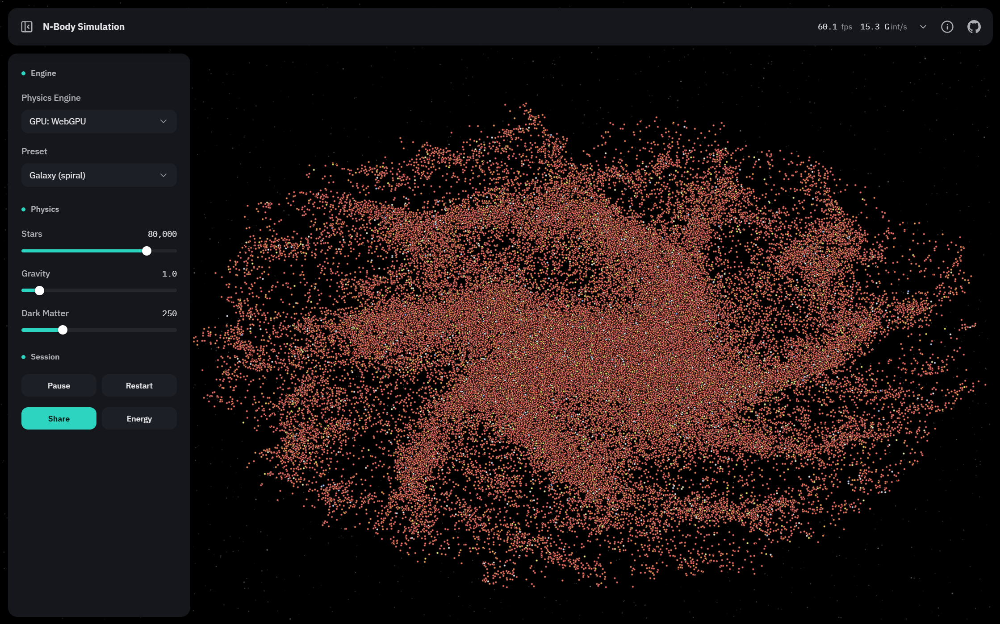
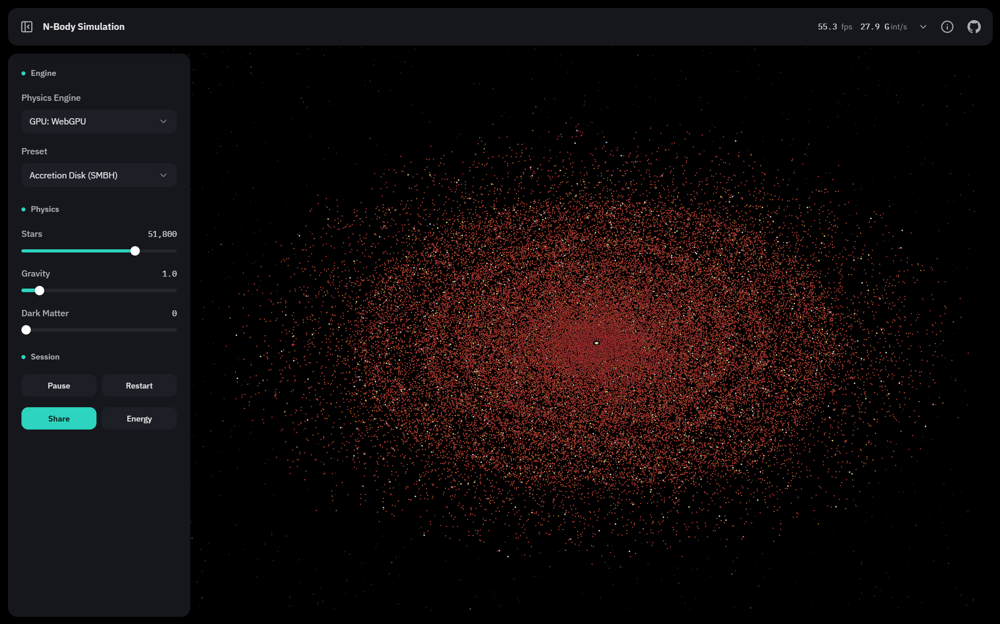
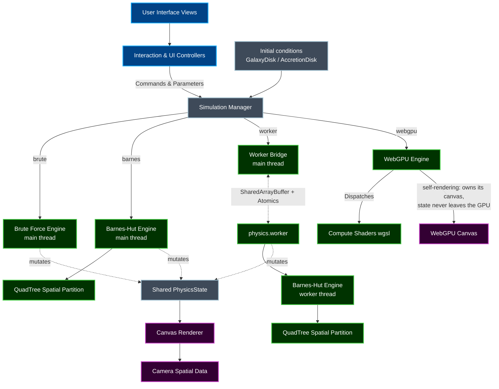

# Galaxy N-Body Simulation

**A galaxy simulator that runs live in your browser. It moves up to 200,000 stars under each other's gravity, and an automated test suite checks its physics against textbook results.**

<table align="center"><tr>
  <td align="center"><br><sub>Galaxy: spiral arms that form from the stars' own gravity</sub></td>
  <td align="center"><br><sub>Accretion disk: stars orbiting a supermassive black hole</sub></td>
</tr></table>

[](https://github.com/sahmed0/galaxy-n-body-simulation/actions/workflows/test.yml)


**[Live Demo](https://galaxy.sajidahmed.co.uk/)** • **[Example share link](https://galaxy.sajidahmed.co.uk/#s=12345&n=10000&e=webgpu&p=galaxy&g=1&dm=250)** (opens the same galaxy every time)

## What is this?

An **N-body simulation** works out how a group of objects move when each one pulls on all the others through gravity. It's the standard tool astronomers use to study how galaxies form and change.

What makes it hard is the amount of computation. Every star pulls on every other star, so 10,000 stars means about 100 million pair calculations for a single step forward in time, and a smooth animation needs dozens of steps per second. This project makes that work in an ordinary web browser by offering four "engines" that solve the same problem in different ways, from a simple exact method up to one that runs on the graphics card.

**At a glance**

- **Fast:** 200,000 stars at 60 frames per second on a laptop's built-in graphics chip.
- **Checked against real physics:** 22 automated test files compare the simulation with known exact answers, such as an orbit that must return to its starting point. They run on every code change, and the site only deploys if they pass.
- **Reproducible:** every simulation starts from a random seed, so a shared link rebuilds exactly the same galaxy.
- **Measured claims:** a built-in benchmark records the speed numbers below, and a live panel shows how well the simulation conserves energy.

## Table of Contents

- [Simulation Presets](#simulation-presets)
- [Features](#features)
- [Verification & Testing](#verification--testing)
- [Benchmarks](#benchmarks)
- [Architecture](#architecture)
- [Key Decisions](#key-decisions)
- [Challenges & Lessons](#challenges--lessons)
- [Reproducibility](#reproducibility)
- [Getting Started](#getting-started)
- [Usage](#usage)
- [Licence](#licence)

## Simulation Presets

- **Galaxy (spiral).** A flat, spinning disk of stars inside an invisible dark-matter halo. The stars' own gravity holds the disk together, and spiral arms keep forming, fading and re-forming. The disk is set up to be only just stable: stable enough not to collapse into clumps, loose enough to grow spiral arms. Astronomers measure this balance with the *Toomre Q* number, which is set to 1.3 here.
- **Accretion disk.** A supermassive black hole at the centre with a disk of lighter stars orbiting it, like planets around the Sun. The black hole dominates, so the stars follow clean elliptical orbits (Keplerian orbits). Gas friction is not modelled, so nothing spirals inwards. The timestep shrinks automatically near the black hole, where orbits are fastest. Dark matter is off by default.

## Features

### Four physics engines

All four calculate the same gravity and can be switched while the simulation is running. Each one has a star limit based on what it can sustain smoothly, and the interface tells you when you hit it.

| Engine | How it works | Where it runs | Max stars |
| :--- | :--- | :--- | ---: |
| **Brute Force** | Exact: every star against every other star, $O(N^2)$ | Main thread | 20 000 |
| **Barnes-Hut** | Approximate: groups distant stars together, $O(N \log N)$ | Main thread | 50 000 |
| **Worker** | Barnes-Hut on a background thread, so the page stays responsive | Web Worker, sharing memory with the page | 50 000 |
| **WebGPU** | Exact, with thousands of stars calculated in parallel | Graphics card (GPU) | 200 000 |

WebGPU is the default. If the browser has no usable GPU, or the GPU stops responding mid-run, the simulation switches to Barnes-Hut. The Worker engine needs a page setting called cross-origin isolation and falls back the same way without it.

### Physics

- **Leapfrog integration.** This is how the simulation steps forward in time. Unlike simpler methods, it keeps the total energy stable over thousands of orbits instead of letting it creep up or down. Positions and velocities are updated half a step apart, which gives it that stability.
- **A galaxy that starts in balance.** Each star's starting speed is calculated from the gravity the actual generated stars produce, not from an idealised formula. Starting speeds are then randomised just enough to hit the Toomre Q target. The result is a disk that holds its shape from the first frame instead of collapsing or flying apart.
- **Adaptive timestep.** The step size shrinks when stars orbit fast or pass close to each other, so fast motion isn't skipped over. A minimum size stops the simulation from grinding to a halt.
- **Dark matter halo.** It's modelled as a smooth background pull rather than millions of extra particles. This is enough to give the galaxy its flat rotation curve, meaning outer stars orbit about as fast as inner ones, as in real galaxies.
- **Realistic star masses and colours.** Star masses follow the Salpeter distribution (many small stars, a few heavy ones), and colours follow the main sequence of the Hertzsprung-Russell diagram (heavy stars blue-white, light stars orange-red).
- **Active and passive stars.** To improve performance, only a subset of stars (the *active* ones) produce gravity, but every star feels it. The active set is always "the first `activeCount` stars", and every engine applies that same rule, so all four simulate exactly the same system. In the accretion preset the active stars are the heaviest ones. In the galaxy preset they are a random sample that carries the disk's full mass.

### Diagnostics

- **Live energy panel.** In a correct simulation total energy should stay almost constant, so its drift is the best single sign of accuracy. The panel plots that drift ($\Delta E/E_0$) for the active stars. The exact energy calculation is expensive, so it's spread over several frames to avoid stutter. The panel is hidden on the WebGPU engine, because the star data never leaves the GPU there.
- **Share links.** The Share button copies a link that rebuilds the same starting galaxy. See [Reproducibility](#reproducibility).
- **Built-in benchmark.** Add `?bench` to the URL to time every engine at every star count and get a ready-made results table.
- **Accurate speed readout.** The top bar shows pair calculations per second, counted exactly for each engine so engines can be compared fairly. The GPU time comes from the GPU's own timer where the hardware supports it.

## Verification & Testing

The physics is checked against exact mathematical answers and conservation laws instead of being judged by eye. There are 22 test files: 21 [Vitest](https://vitest.dev/) suites and one [Playwright](https://playwright.dev/) suite that runs the app in a real browser. Both run on every push, and the site only deploys if they pass.

```bash
pnpm test      # unit + analytic suites (vitest)
pnpm e2e       # real-browser smoke suite (playwright, chromium)
```

**In short, the tests show that:**

- orbits, forces and energy behave the way the textbook says they should
- all four engines compute the same gravity from the same stars
- the same seed always produces the same galaxy, byte for byte
- every engine actually draws to the screen in a real browser

### What each suite checks

| Suite | What it checks |
| :--- | :--- |
| `tests/physics/integrator.test.ts` | A two-body orbit returns to its starting point after one period. Leapfrog keeps energy within a fixed band, while the simpler Euler method drifts steadily away. Both use the identical force law, so the difference comes only from the integrator. |
| `tests/physics/conservation.test.ts` | Total momentum is conserved, and the centre of mass moves in a straight line to float64 precision over 4 000 steps. Any star pushing itself, or a lopsided force, would show up here. |
| `tests/physics/field-terms.test.ts` | All three force formulas (black hole, dark matter halo, star-to-star) match their exact equations, including flat rotation curves far out and finite force when two stars overlap. |
| `tests/physics/barnes-hut.test.ts` | Barnes-Hut's only error comes from its grouping approximation. With grouping switched off ($\theta = 0$) it matches brute force exactly, and its error shrinks steadily as $\theta$ decreases. |
| `tests/physics/quadtree.test.ts` | The tree used by Barnes-Hut keeps total mass correct, and every node's centre of mass is exact, even when stars overlap. |
| `tests/physics/engine-energy.test.ts` | The real engines, running for 5 000 steps, keep total energy within a fixed band. The pinned black hole never moves. |
| `tests/physics/energy-monitor.test.ts` | The live energy panel's frame-by-frame calculation gives exactly the same answer as a direct calculation, however it's split up, and it never shows an out-of-date value. |
| `tests/physics/worker-protocol.test.ts` | The background worker never counts a step twice, and the simulation clock only advances for steps that actually finished. |
| `tests/physics/engine-parity.test.ts` | Every engine uses the same stars as gravity sources: one step of brute force and of Barnes-Hut (at $\theta = 0$) both match a direct calculation, for an active and a passive star. |
| `tests/state/ic-fixture.test.ts` | The starting galaxy for fixed seeds is frozen byte for byte, so a code change can't silently alter what a share link shows. |
| `tests/state/salpeter.test.ts` | Star masses really do follow the Salpeter distribution (a Kolmogorov-Smirnov statistical test). A fixed seed keeps the test from failing randomly. |
| `tests/state/determinism.test.ts` | One seed always produces exactly one galaxy, byte for byte, for both presets. Share links depend on this. |
| `tests/state/adaptive-timestep.test.ts` | The timestep is always small enough for the fastest orbit and never drops below its minimum. |
| `tests/gpu/uniform-layout.test.ts` | Reads the GPU shader source and confirms the TypeScript code writes settings to the GPU in exactly the layout the shader expects. A mismatch here would corrupt the simulation with no error. |
| `src/state/SimulationManager.*.test.ts` | The starting galaxy is genuinely in balance under the engines' real forces and stays together. The accretion disk orbits are truly Keplerian. Switching to a fallback engine, and recovering when the GPU is lost, both work. |
| `e2e/smoke.spec.ts` | Things unit tests can't reach: every CPU engine (including the worker) actually draws in a real browser, the energy panel goes live, WebGPU falls back cleanly, and a share link gives the same galaxy across two separate page loads. |

**Tolerances.** Each numeric limit was measured first and then set with some margin, and the measured value is recorded in a comment beside it. The goal is to catch physically meaningful errors, not tiny rounding differences.

**Coverage.** Line coverage is 64.7% overall, and it's uneven on purpose. The physics core (`kernels`, `energy`, `BarnesHutEngine`, `BruteForceEngine`, `QuadTree`) is at 98-100%. The GPU engine, worker bridge, renderers and energy panel are near zero in Vitest because they need a real GPU, thread or canvas. The Playwright suite tests those in a real browser instead.

## Benchmarks

All numbers are measured by the app's own benchmark. Open **`/?bench`** and click *Run benchmark*. It times every engine at every star count and produces the table below.

**How it's measured.** The galaxy preset with one fixed seed, so every engine faces the same starting stars. A 2-second warm-up is discarded, then performance is measured over 5 seconds. GPU time comes from WebGPU's `timestamp-query` timer where available. Otherwise a rougher wall-clock reading is used and marked `(approx)`.

**Hardware:** Intel Core i5 12500H / Intel Iris Xe / Chrome 154 / Windows 11

| engine | kernel | N | steps/s | frame ms | GPU pass ms |
|---|---|---|---|---|---|
| brute | - | 5000 | 16.5 | 302.22 | - |
| brute | - | 10000 | 9.3 | 537.50 | - |
| brute | - | 20000 | 5.0 | 1004.78 | - |
| barnes | - | 10000 | 50.1 | 99.94 | - |
| barnes | - | 20000 | 25.9 | 192.80 | - |
| barnes | - | 50000 | 10.0 | 500.86 | - |
| worker | - | 10000 | 30.0 | 16.61 | - |
| worker | - | 20000 | 20.0 | 16.63 | - |
| worker | - | 50000 | 9.9 | 16.65 | - |
| webgpu | naive | 10000 | 62.5 | 16.64 | 8.014 |
| webgpu | naive | 50000 | 62.4 | 16.65 | 9.587 |
| webgpu | naive | 100000 | 62.4 | 16.65 | 14.930 |
| webgpu | naive | 200000 | 62.6 | 16.62 | 28.049 |
| webgpu | tiled | 10000 | 62.4 | 16.66 | 8.569 |
| webgpu | tiled | 50000 | 62.4 | 16.64 | 9.750 |
| webgpu | tiled | 100000 | 62.4 | 16.64 | 10.395 |
| webgpu | tiled | 200000 | 62.7 | 16.61 | 15.860 |

**Reading the table.** The worker and WebGPU rows are capped at the screen's 60 Hz refresh rate, which is why their frame times sit at about 16.6 ms. The WebGPU engine takes one step per frame, so its steps/s is capped too. For WebGPU, compare the **GPU pass** column instead: at 200,000 stars, the tiled kernel takes 15.9 ms against 28.0 ms for the naive one.

**Tiled vs naive check** (N=4096): RMS Δpos = 0.000e+0 - PASS (< 1e-3). The faster tiled GPU kernel gives the same results as the simple one.

## Architecture

```text
~/n-body/
├── index.html              # The single page: canvas, top bar, sidebar, About content (KaTeX)
├── vite.config.ts          # Build + COOP/COEP headers for dev & preview
├── vitest.config.ts
├── playwright.config.ts
├── e2e/
│   └── smoke.spec.ts       # Real-browser smoke suite
├── tests/                  # Analytic & conservation suites (physics/, state/, gpu/, utils/)
└── src/
    ├── main.ts             # Bootstrapper: permalink parsing, canvas, UI wiring, ?bench loading
    ├── global.css          # Page-level layout and resets
    ├── physics/
    │   ├── kernels.ts          # Pure acceleration functions + integrator steps
    │   ├── BruteForceEngine.ts # O(N^2) direct sum, main thread
    │   ├── BarnesHutEngine.ts  # O(N log N), main thread
    │   ├── QuadTree.ts         # Spatial partition with an object pool
    │   ├── WorkerBridge.ts     # Main-thread handle to the worker engine
    │   ├── physics.worker.ts   # Worker thread: runs Barnes-Hut
    │   ├── PhysicsMemory.ts    # SharedArrayBuffer + the SAB slot protocol
    │   ├── PhysicsState.ts     # Structure-of-arrays particle state
    │   ├── WebGPUEngine.ts     # GPU compute + render pipeline
    │   ├── shaders.wgsl        # Naive + workgroup-tiled force kernels
    │   ├── energy.ts           # Analytic potentials + the chunked EnergyMonitor
    │   └── types.ts            # EngineType, engine caps, engine + params interfaces
    ├── rendering/
    │   ├── Camera.ts
    │   └── CanvasRenderer.ts   # Reads shared state; colour-batched, DPR-aware
    ├── state/
    │   ├── SimulationManager.ts # Engine selection, fixed-dt loop, seeding
    │   ├── enginePresets.ts     # Per-engine theta, softening and timestep defaults
    │   ├── params.ts            # SimulationParams: physics, preset and UI state
    │   └── ic/
    │       ├── common.ts        # Shared IC helpers: halo accel, Salpeter sampler, radii
    │       ├── GalaxyDisk.ts    # Self-gravitating disk: measured rotation curve, Toomre Q
    │       └── AccretionDisk.ts # Keplerian test-particle disk about a pinned SMBH
    ├── ui/
    │   ├── UIController.ts
    │   ├── InteractionController.ts
    │   ├── TopBar.ts           # Brand, telemetry readouts, sidebar toggle, About button
    │   ├── Sidebar.ts          # Preset, engine, physics and session controls; a sheet when narrow
    │   ├── AboutPanel.ts       # Slide-over with the background reading (KaTeX)
    │   ├── EnergyPanel.ts      # Collapsible dE/E0 plot
    │   ├── slider.ts           # Log-scaled star-count slider mapping
    │   ├── icons.ts            # Inlined Lucide SVGs
    │   ├── tokens.css          # Colour, spacing and type tokens
    │   └── ui.css
    ├── bench/
    │   └── benchmark.ts        # ?bench sweep (dynamic import; off the main bundle)
    └── utils/                  # dom, rng, permalink, format, colour helpers
```

### High-Level Subsystem Flow


```mermaid
graph TD
    classDef ui fill:#014386,stroke:#00aaff,stroke-width:2px,color:#fff;
    classDef core fill:#3e4a59,stroke:#a0c0d0,stroke-width:2px,color:#fff;
    classDef physics fill:#003300,stroke:#44cc44,stroke-width:2px,color:#fff;
    classDef render fill:#330033,stroke:#cc44cc,stroke-width:2px,color:#fff;

    A[User Interface Views]:::ui --> B[Interaction & UI Controllers]:::ui
    B -->|Commands & Parameters| C[Simulation Manager]:::core
    Q[Initial conditions<br/>GalaxyDisk / AccretionDisk]:::core --> C

    C -->|brute| D[Brute Force Engine<br/>main thread]:::physics
    C -->|barnes| E[Barnes-Hut Engine<br/>main thread]:::physics
    C -->|worker| F[Worker Bridge<br/>main thread]:::physics
    C -->|webgpu| G[WebGPU Engine]:::physics

    E --> H[QuadTree Spatial Partition]:::physics
    F <-.->|SharedArrayBuffer + Atomics| I[physics.worker]:::physics
    I --> J[Barnes-Hut Engine<br/>worker thread]:::physics
    J --> K[QuadTree Spatial Partition]:::physics
    G -->|Dispatches| L[Compute Shaders wgsl]:::physics

    D -.->|mutates| M[Shared PhysicsState]:::core
    E -.->|mutates| M
    I -.->|mutates| M
    M --> N[Canvas Renderer]:::render
    N --> O[Camera Spatial Data]:::render

    G -->|self-rendering: owns its canvas,<br/>state never leaves the GPU| P[WebGPU Canvas]:::render
```

**How the engines get drawn.** The three CPU engines all write to one shared `PhysicsState`, and `CanvasRenderer` draws straight from it. For the Worker engine, that state lives in a `SharedArrayBuffer` that both threads can see, so drawing the worker's output needs no copying. The WebGPU engine works differently: it draws to its own canvas, and the star data never leaves the GPU.

## Key Decisions

| Decision | Why |
| :--- | :--- |
| **WebGPU instead of WebGL** | WebGPU has proper compute shaders and storage buffers. WebGL was built for drawing, not general calculation, so the parallel gravity calculation fits WebGPU much better. |
| **Tiled GPU kernel** | The default GPU kernel loads stars in batches of 64 into fast on-chip memory that a group of threads shares, instead of each thread fetching every star from slower main GPU memory. The simple (naive) kernel still ships alongside it, and the benchmark checks that both give the same results, so the speed-up is verified rather than assumed. |
| **Shared memory for the Worker engine** | The worker runs Barnes-Hut on a background thread. Sharing one block of memory (`SharedArrayBuffer`) with the page avoids copying every star's position between threads on every frame. Only the Worker engine uses it. |
| **One force function for all CPU engines** | Brute force calculates each pair of stars twice instead of using Newton's third law to halve the work. That costs 2× the arithmetic, but every CPU engine then uses the same tested force function (`pairwiseAccel`). As a result, any difference between Barnes-Hut and brute force can only come from Barnes-Hut's approximation. |
| **Active stars chosen by position in the list** | Every engine treats stars `[start, activeCount)` as the gravity sources, set once by the preset. Choosing them by mass instead would let engines disagree. That bug really happened once, and it's described in [Challenges](#challenges--lessons). |
| **Two GPU buffers, swapped each step** | The shader reads from one buffer and writes to the other, so no thread ever reads a value another thread is overwriting. The drawing code reads the output buffer directly on the GPU, with no copy back to the CPU. |
| **Leapfrog integrator** | Picked over Euler and Runge-Kutta because it keeps energy stable over thousands of orbits, where those methods slowly drift. |
| **Energy panel measures only the active stars** | Passive stars feel gravity but don't produce it. That one-way pull saves a lot of work, but it means the energy of the whole system is not expected to stay constant, so measuring it would only show a side effect of the shortcut. The active stars on their own form a proper closed system, so their energy is the meaningful thing to track. |

## Challenges & Lessons

### Keeping two threads in step

The Worker engine coordinates the page and the background thread with `Atomics.wait` and `Atomics.notify` on a single shared status flag.

- **The hard part wasn't the handshake, it was the bookkeeping.** If the worker is still busy when a new frame arrives, that frame's step is skipped. The simulation clock may only advance for steps that actually finished, or it quietly runs too fast.
- **The order of operations matters.** Drawing waits on the same flag, so the page never draws half-updated positions. When I started the next step before drawing the last one, the canvas froze, while every counter still reported normal progress.

### Garbage collection slowing every frame

Barnes-Hut rebuilds its tree every frame, and creating thousands of new objects each time made the browser's garbage collector pause constantly. I fixed it in two ways:

- The tree reuses its nodes from a pool instead of creating new ones.
- The force functions write into an object the caller passes in, instead of returning a new object on every call.

### Learning to think like a GPU

On a GPU, groups of threads run in lockstep, so an `if` that sends threads different ways makes them wait for each other. The tiled kernel also has sync points (`workgroupBarrier`) that every thread in the group must reach. As a result, a thread with no star to process can't simply exit early. It carries a "valid" flag and runs to the end with everyone else. The classic bug in tiled N-body code is a barrier that some threads never reach.

### Four engines that quietly disagreed

- **The bug.** Brute force and the GPU chose gravity sources by their position in the list. Barnes-Hut chose them by mass, keeping stars above a threshold.
- **Why it hid.** In the accretion preset, stars are sorted by mass, so both rules picked the same stars. In the galaxy preset every disk star has the same mass, so Barnes-Hut counted far more of them as sources. It simulated a disk 3.3× heavier than the one the starting conditions were balanced for, and its energy drift was 100,000 times worse than brute force.
- **Why the tests missed it.** Every galaxy test used so few stars that all of them were active, so the two rules never differed.
- **How it was found and fixed.** A test comparing Barnes-Hut (with approximation off) against brute force, with the active/passive split switched on, exposed it in one step. That comparison is now a permanent test, and every engine reads the same `activeCount` value.
- **The lesson.** When several engines must agree on a rule, give them one shared value to read rather than letting each one re-implement the rule.

## Reproducibility

Every simulation is built from a random seed, so any run can be shared and rebuilt exactly.

**Link format:** `/#s=<seed>&n=<count>&e=<engine>&p=<preset>&g=<gravity>&dm=<dmStrength>`

The **Share** button copies a link containing the current seed and settings. Each setting in the link is checked on its own when the page loads. An invalid value is ignored and that setting uses its default, so a damaged link still loads.

**What a seed reproduces.** A seed rebuilds the *starting* galaxy, not the moment you were watching when you copied the link. Pressing *Restart* picks a new seed and a new galaxy. A share link always keeps its own seed.

**Across different machines.** On the same browser and hardware, results match bit for bit. Different hardware can round numbers very slightly differently. Because gravity simulations are chaotic, those tiny differences eventually grow into a visibly different galaxy. That's a property of the physics, and this README documents it rather than working around it.

## Getting Started

### Prerequisites

- [Node.js](https://nodejs.org/) 24 (the version CI uses) and [pnpm](https://pnpm.io/).
- **A WebGPU-capable browser is optional.** Without one, the simulation falls back to the CPU engines automatically.
- **Only the Worker engine needs cross-origin isolation**, because `SharedArrayBuffer` requires it. Vite sends the needed COOP/COEP headers in both `dev` and `preview`, and the hosted demo adds them through `coi-serviceworker`. Every other engine works without them.

### Installation

1. Clone the repository and navigate to the project directory:

   ```bash
   git clone https://github.com/sahmed0/galaxy-n-body-simulation.git
   cd galaxy-n-body-simulation
   ```

2. Install dependencies:

   ```bash
   pnpm install
   ```

3. Start the local development server:

   ```bash
   pnpm dev
   ```

## Usage

Open the local server URL (usually `http://localhost:5173`). The simulation starts straight away. The info button in the top bar opens the About panel, which explains the physics. Add `?bench` to the URL to open the benchmark.

### CLI Commands

| Command | Description |
| :--- | :--- |
| `pnpm dev` | Start the Vite development server. |
| `pnpm build` | Type-check (`tsc`) and create a production build. |
| `pnpm preview` | Preview the production build locally, with COOP/COEP headers. |
| `pnpm test` | Run the unit and analytic suites once. |
| `pnpm test:watch` | Run the unit suites in watch mode. |
| `pnpm test:coverage` | Run the unit suites with a V8 coverage report. |
| `pnpm e2e` | Run the Playwright browser smoke suite. |
| `pnpm lint` | Lint the project with ESLint. |

---

## Licence

MIT. See [LICENSE](./LICENSE).
